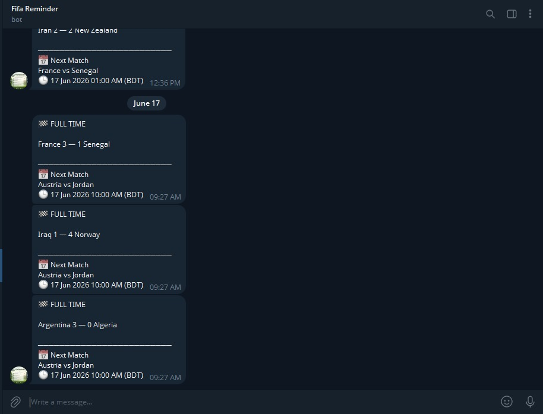

# ⚽ FIFA World Cup 2026 Telegram Bot

A Telegram bot that automatically sends FIFA World Cup 2026 match notifications, including:

- ⏰ 30-minute pre-match reminders
- ⚽ Goal updates
- 🏁 Half-time score updates
- 🏆 Full-time score updates
- 📅 Next match information
- 🌍 Bangladesh (BDT) timezone support
- 🤖 Easy deployment with GitHub Actions

---

## Preview

### Match Notifications



---

## Features

✅ Match reminders before kick-off

✅ Half-time score notifications

✅ Full-time score notifications

✅ Goal scorer updates

✅ Next match schedule

✅ Automated monitoring

✅ GitHub Actions compatible

---

## Requirements

- Python 3.10+
- Telegram Bot Token
- Football Data API Key

---

## Create Your Telegram Bot

### Step 1: Create a Bot

1. Open Telegram
2. Search for **BotFather**
3. Send:

```text
/newbot
```

4. Choose a bot name

Example:

```text
Fifa Reminder
```

5. Choose a username ending with `bot`

Example:

```text
FifaReminderBot
```

6. Copy the Bot Token

Example:

```text
123456789:AAxxxxxxxxxxxxxxxxxxxxxxxx
```

> Keep your token secret.

---

## Get Your Telegram Chat ID

1. Search for:

```text
@userinfobot
```

2. Press:

```text
/start
```

3. Copy your User ID.

---

## Installation

Clone the repository:

```bash
git clone https://github.com/ENiGMA-101/FIFA-World-cup-2026-telegram-bot.git

cd FIFA-World-cup-2026-telegram-bot
```

Install dependencies:

```bash
pip install -r requirements.txt
```

---

## Configuration

Open:

```python
config.py
```

Replace:

```python
BOT_TOKEN = "YOUR_TELEGRAM_BOT_TOKEN"
CHAT_ID = "YOUR_CHAT_ID"
API_KEY = "YOUR_API_KEY"
```

with your own credentials.

---

## Run Locally

```bash
python bot.py
```

---

## Deploy Using GitHub Actions

1. Fork this repository
2. Open:

```text
Settings → Secrets and variables → Actions
```

3. Add:

| Secret Name | Value |
|------------|--------|
| BOT_TOKEN | Telegram Bot Token |
| CHAT_ID | Telegram User ID |
| API_KEY | Football API Key |

4. Enable GitHub Actions

The workflow will run automatically.

---

## Project Structure

```text
├── bot.py
├── config.py
├── requirements.txt
├── FIFA_World_Cup_2026.ics
├── assets/
│   ├── BotMessage.png
│   ├── botcreate.png
│   └── userinfo.png
└── README.md
```

---

## Security

❌ Never upload:

- Telegram Bot Token
- API Keys
- Chat IDs

Use GitHub Secrets instead.

If a token is exposed, revoke it immediately via BotFather and generate a new one. Exposure of Telegram bot tokens can allow others to control the bot. :contentReference[oaicite:0]{index=0}

---

## Data Source

This bot uses football match data APIs and World Cup fixture data. Public World Cup fixture datasets are also available from open football data projects. :contentReference[oaicite:1]{index=1}

---

## License

MIT License

---

## Author

Created by **H4MDiL**

GitHub:
https://github.com/ENiGMA-101

---

### ⭐ If you find this project useful, consider giving it a star.
